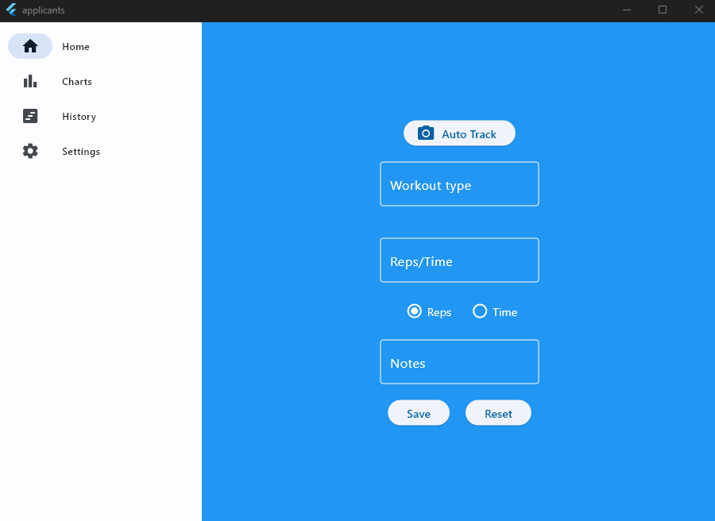
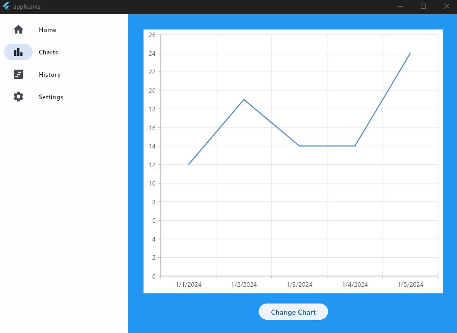
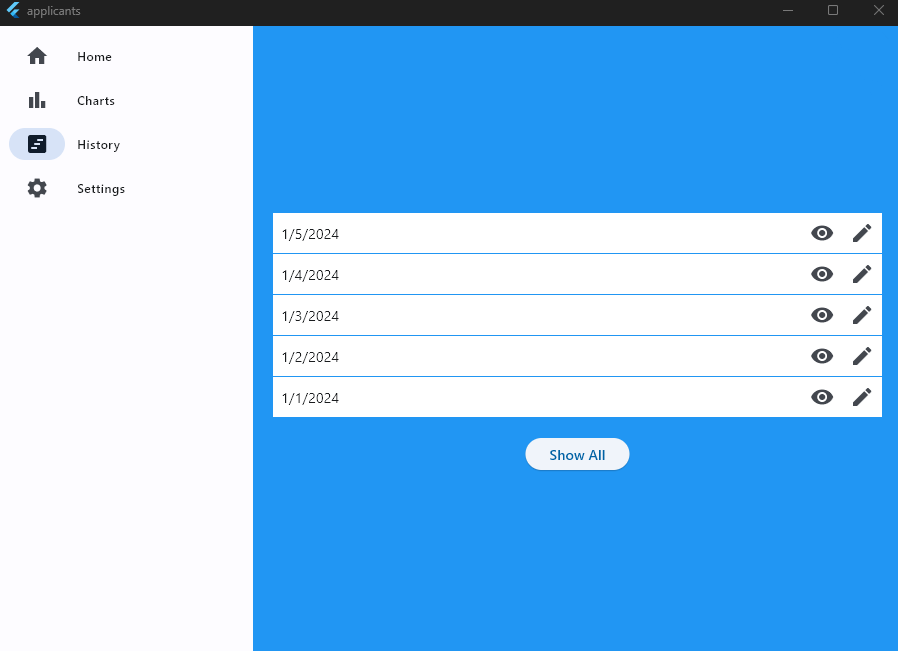
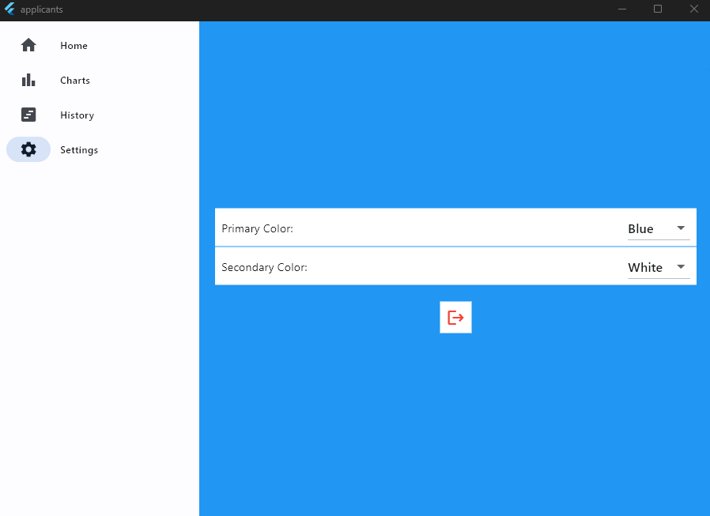

# How to use the Applicant's Application

<ol>
<li>[Installation](#Installation)</li>
<li>[Home Page](#home-page)</li>
<li>[Graph Page](#graph-page)</li>
<li>[History Page](#history-page)</li>
<li>[Setting Page](#setting-page)</li>
<li>[FAQ](#faq)</li>
<ol>

## Installation

The application can be downloaded on a multitude of platforms and explanations for each is as simple as downloading the file for your given device and running the application.

## Home page

The home page is the page in which you enter your current workout information including the workout type, reps, and additional notes. The information can be entered manually or you can use your camera to track the workout information for you. If entering the information manually you can save the workout information or clear out the information.

## Charts page

The charts page serves as a page where you can visualize your workout information. This allows the option to view your progress to get a better understanding of your workouts and your progress.

## History page

The history page shows you your previous workouts and allows you to view or edit as you see fit

## Settings page

The settings page allows you to customize your experience with the application. It allows options such as what color you want the application to be, logging out, etc.

## FAQ

<ul>
<li>Does the camera-tracked workout track all types of workouts?</li>
No, the camera-tracked workout currently only tracks squatting, but we are looking to add more workouts in the future. 
<li>How long does the history log go back?</li>
The history log goes back to the entirety of the time you tracked your workouts.
<li>What data is used to create the graphs?</li>
The data used to create the graphs are your previous workouts which can be found in the history log.
</ul>