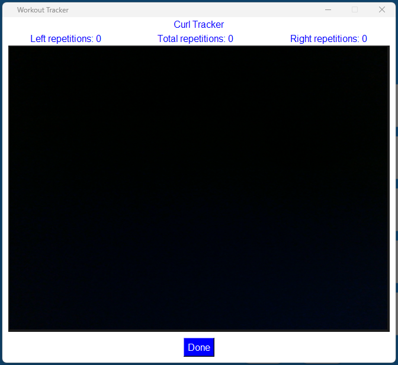
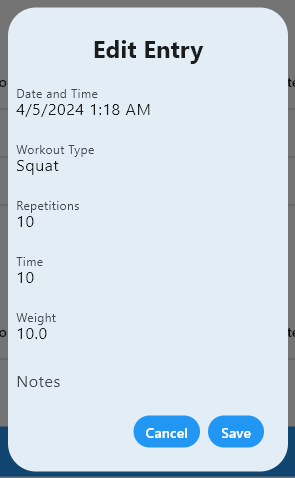

# How to use the Applicant's Workout Application

- [Installation](#installation)
- [Home Page](#home-page)
- [Graph Page](#graph-page)
- [History Page](#history-page)
- [Setting Page](#setting-page)
- [FAQ](#faq)

## Installation

The installation is as simple as running the application on your device of choice. Another option is downloading The source code and building the application for your specific platform by using the Flutter steps found on Flutter's website. The pages for each platform are as follows:

Android: https://docs.flutter.dev/deployment/android
iOS: https://docs.flutter.dev/deployment/ios
Windows: https://docs.flutter.dev/deployment/windows
MacOS: https://docs.flutter.dev/deployment/macos
Linux: https://docs.flutter.dev/deployment/linux

## Home Page

The home page is the page where you enter your current workout set information including the workout type, repetitions, time, weight, and additional notes. The information can be entered manually, or you can use your camera to track the workout information.

The home page entry fields are as follows:
<ul>
<li>Workout type - the workout that was performed for the set</li>
<li>Repetitions - the number of repetitions done in the set</li>
<li>Time - the time in seconds that the set took</li>
<li>Weight - the weight amount used in the set</li>
<li>Notes - anything that should be noted about the set</li>
</ul>

With manual entry, values can be entered for each set and will be saved by pressing the "Save" button or can be cleared by pressing the "Clear" button. Another note is that when the setting "Enable Predictions" is enabled and a previously entered workout type is entered, a recommendation for the repetitions will be shown in the repetitions field. The recommended value is based on the previously entered information.

Auto tracking can be performed by pressing the "Auto Track" button. Upon pressing the "Auto Track" button, a dialog will appear allowing for the workout type and weight amount to be selected.

Once the "Track" button is pressed the workout tracker page will appear. The page shows the repetition count, the camera's view, and the "Done" button. The camera display shows the tracking taking place and the elements needing the camera's clear view to be tracked for the given workout. The dots on the individual must be green for the repetition to be counted when performing the workout. The repetition count is updated in real-time. When finished with the set select the "Done" button to have the information entered into the home page entry field, and the workout tracker page will be closed. Once back to the home page, the workout information can be changed or saved.

## Chart Page

The charts page serves as a page where you can visualize your workout information. This allows the option to view your progress to get a better understanding of your workouts and your progress.

The chart will display the desired values selected in the change chart dialog. The chart can display the expected values when predictions are enabled in the settings. The expected values show what value would be expected for each day based on the previously entered data.

The chart can be created or changed by pressing the "Change Chart" button. Once the button is pressed, the change chart dialog will appear allowing the user to select the following options:
<ul>
<li>Workout type - the workout type that the chart should use as the data</li>
<li>Workout value - the workout value that the chart should use as the data</li>
<li>Aggregate - whether the chart should use purely the workout value count or the average</li>
<li>From - the starting date the chart values will be displayed </li>
<li>To - the starting date the chart values will be displayed </li>
</ul>
Once all the change chart values are selected the "Create" button can be pressed to display the chart based on the dialog options. The "Cancel" button can be pressed to display the chart before the "Change Chart" button is pressed.

## History Page

The history page shows you your previous workouts and allows you to view or edit as you see fit.

The history displays the dates of all the workouts entered into the application and has a view button next to each date to view, edit, or delete the entries for the selected date. The view button will open the view history page.

When the view history page is opened, each workout performed on the given date can be selected along with a delete and edit button. The delete button will delete the entry for the log and can not be retrieved after the delete has been performed. The edit button will open the edit history dialog. The additional "Go Back To History Page" button at the bottom of the page will open the view history page.

The edit history dialog allows for the changing of any entered workout information and has the same forms as the home page, which are as follows:
<ul>
<li>Workout type - the workout type that the chart should use as the data</li>
<li>Workout value - the workout value that the chart should use as the data</li>
<li>Aggregate - whether the chart should use purely the workout value count or the average</li>
<li>From - the starting date the chart values will be displayed </li>
<li>To - the starting date the chart values will be displayed </li>
</ul>
The "Cancel" can be used to discard any changes made and return to the view history page. The "Save" will save the changes made in the edit history dialog and return to the view history page with the updated changes.

## Calendar Page
The calendar page allows for easier visualization of previous workouts in a calendar format. When selecting a date on the calendar at the bottom of the page the workouts entered for that date will be displayed. 

## Settings Page

The settings page allows you to customize your experience with the application. It allows options such as enabling predictions, what color you want the application to be, and logging out. The "Enable Predictions" setting is off by default due to the calculated value not being exact. The "Enable Predictions" allows recommended repetitions on the home page and the expected values to be included on the chart.

## FAQ

<ul>
<li>Does the Auto Track workout track all types of workouts?</li>
No, the camera-tracked workout currently only tracks curls and squatting, but we are looking to add more workouts in the future.
<li>Does the Auto Track workout record the workout?</li>
No, the Auto Track feature does not record the workout.
<li>How are the predictions made?</li>
The predictions are made by analyzing the previously entered workouts and calculating from that data what would be expected. 
<li>How long does the history log go back?</li>
The history log goes back to the entirety of the time you tracked your workouts.
<li>What data is used to create the graphs?</li>
The data used to create the graphs are your previous workouts which can be found in the history log.
</ul>
